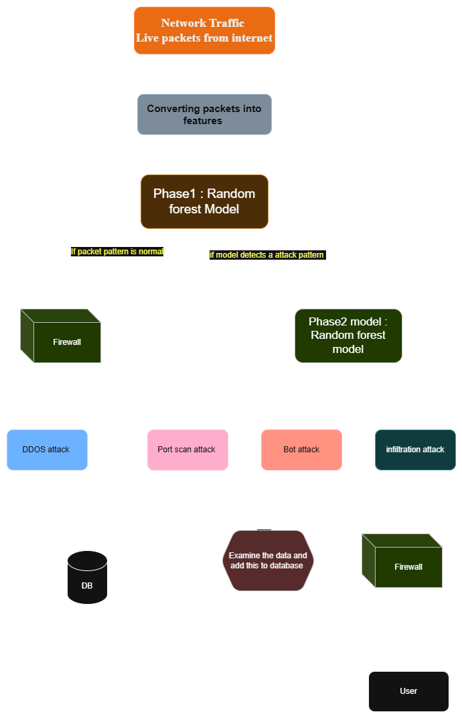

Capstone Project — Network Packet Analysis & Monitoring
=======================================================

Summary
-------
This project analyzes network traffic captured in PCAP/PCAPNG files, runs a two-stage detection/classification pipeline, and supports both user-driven file analysis via a small Flask web app and live monitoring via a Streamlit dashboard.
# Diagram 

Working
-------
This section describes how traffic is processed end-to-end.

- Inputs: uploaded PCAP/PCAPNG files (saved to `uploads/`) or live packets captured by `streaming/producer.py` (Scapy).
- Flow grouping: `src/Captured.analyze_pcap()` groups packets by `(src, dst, proto)` into flows; flows with fewer than 3 packets are ignored.
- Feature extraction: `src/Captured.extract_features(pkts)` computes timestamps, sizes, inter-arrival times, flag counts, rates and other flow metrics and returns a feature dict per flow.
- Data preparation: feature dicts are collected into a pandas DataFrame for batch processing.
- Two-stage ML pipeline: `models/pipeline.Full_pipeline` performs cleaning and feature selection, then:
  - Phase 1 (`model_phase1.pkl`) predicts attack probability per flow and produces a binary attack mask.
  - Phase 2 (`model_phase2.pkl`) classifies attack flows into attack types; results are paired with flow timestamps.
- Outputs: the pipeline returns `normal_count`, `attack_count`, `attacks` (list of timestamp,label pairs), and a `model_health` status string.
- Model health: `model_health/timebased.timebased_model_health(confidence, total_flows)` checks confidence and model file ages to recommend retraining if necessary.
- Web workflow: `main.py` (Flask) handles file uploads at `/predicting`, saves files to `uploads/`, calls `analyze_pcap()`, and renders results in `template/prediction.html`.
- Real-time workflow: `dashboard.py` (Streamlit) calls `streaming.producer.producer_pcap(packet_count)` which sniffs a short batch, writes a temporary PCAP, calls `analyze_pcap()` and returns metrics; the dashboard updates live metrics and tables and the temp PCAP is deleted after analysis.
- Retraining and CSV export: `src/Captured.convert_pcap_to_csv()` exports flow features to CSV for training; retraining utilities in `retraning_pipeline/` rebuild models and save new pickles to `models/`.

Key features
- File-based analysis: upload a PCAP to the web UI (`main.py`) and receive flow-level predictions.
- Real-time monitoring: a Streamlit dashboard (`dashboard.py`) visualizes live packet capture metrics and detected attacks.
- Two-stage model pipeline: `models/pipeline.py` loads two pickled models (`model_phase1.pkl` for binary detection and `model_phase2.pkl` for attack-type classification).
- Retraining utilities: `retraning_pipeline/retraining_pipeline.py` contains scripts to retrain models from CSV data.

Requirements & setup
--------------------
- Python 3.8+ and the packages in `requirements.txt`.
- Scapy and packet capture dependencies. On Windows, install Npcap (winpcap replacement) and run with appropriate privileges to allow live capture.

Quick start (Windows example)

```powershell
python -m venv .venv
.\.venv\Scripts\Activate.ps1
pip install -r requirements.txt

# Run the web upload app (Flask)
python main.py

# Run the real-time dashboard (Streamlit)
streamlit run dashboard.py
```

This project analyzes network traffic to detect and classify attacks. It supports two workflows:

1) File-based analysis (web upload): user uploads a PCAP/PCAPNG via the Flask app (`main.py`). The backend saves the upload to `uploads/`, parses flows with `src/Captured.py`, extracts features, runs `models/pipeline.Full_pipeline` which uses two models (`model_phase1.pkl` for detection and `model_phase2.pkl` for attack classification), and returns counts, per-flow labels, and a `model_health` status.

2) Real-time monitoring (dashboard): Streamlit dashboard (`dashboard.py`) triggers `streaming/producer.producer_pcap()` to capture short batches with Scapy, save a temp PCAP, call `src.Captured.analyze_pcap()`, and update live metrics and attack tables. `model_health/timebased.py` provides a simple health check used by both workflows.

Important files and locations:
- `main.py` — Flask web app and upload endpoint (`/predicting`).
- `dashboard.py` — Streamlit real-time dashboard.
- `src/Captured.py` — PCAP parsing, feature extraction, `analyze_pcap()` and `convert_pcap_to_csv()`.
- `models/pipeline.py` — `Full_pipeline` implementing cleaning, detection, and classification using pickled models in `models/`.
- `streaming/producer.py` — live capture helper that writes a temp pcap and calls analysis.
- `retraning_pipeline/retraining_pipeline.py` — retraining utilities (typo in folder name: consider `retraining_pipeline`).
- `model_health/timebased.py` — time and confidence based health checks.
- `template/` and `static/` — Flask templates and static assets.

How to run (examples):

```powershell
# Install dependencies
python -m venv .venv
.\.venv\Scripts\Activate.ps1
pip install -r requirements.txt

# Run web upload app
python main.py

# Run Streamlit dashboard
streamlit run dashboard.py
```

Notes:
- Live capture requires OS-level packet capture support (Npcap on Windows) and appropriate privileges.
- Uploaded PCAPs are stored in `uploads/` and can be processed offline by calling `src.Captured.analyze_pcap()`.
- Consider renaming `retraning_pipeline` → `retraining_pipeline` to avoid import confusion.


Notebook and data directories
- `eda/`: Exploratory Data Analysis notebooks and CSV snapshots.
  - `data_man.ipynb`, `Eda_new.ipynb`, `eda_phase2.ipynb`, `model_evaluation.ipynb`: Notebooks used to explore data, run feature engineering experiments, and evaluate models.
  - `phase2.csv`, `phase2_cleaned.csv`, `cleaned_phase1_dataset.csv`: Dataset snapshots produced during EDA and cleaning.

Data and sample captures
- `uploads/Sample.pcapng` and `src/Sample.pcapng`: Example packet capture files you can use for testing and development.

Source code
- `src/Captured.py`: Utilities or classes for parsing/representing captured network packets (PCAP parsing helpers).

Streaming and producers
- `streaming/producer.py`: Simulates or streams packet data into the pipeline. Use this to generate real-time input for testing the streaming components.

Models and pipelines
- `models/pipeline.py`: The model training and inference pipeline. This is where feature extraction, model training, persistence (save/load), and prediction logic live.

Retraining and model maintenance
- `retraning_pipeline/retraining_pipeline.py`: Orchestrates automatic or scheduled retraining of models when new data arrives (note: folder name has a typo — `retraning_pipeline` — consider renaming to `retraining_pipeline` for clarity).

Model health and utilities
- `model_health/timebased.py`: Tools for validating model behavior over time, drift detection, or time-based performance checks.

Web/templates and static UI
- `template/`:
  - `index.html`, `model.html`, `prediction.html`: HTML templates for the web interface for prediction and model display.
- `static/images/`: Images or assets used by the dashboard or web UI.

How to use (common tasks)
-------------------------
- Run EDA notebooks: open the notebooks in `eda/` using Jupyter or VS Code to inspect the datasets and reproduce analysis steps.
- Train a model (typical): run `models/pipeline.py` (or follow the notebook instructions) to preprocess, train, and save model artifacts.
- Simulate streaming input: run `python streaming/producer.py` to emit packet events into the pipeline for testing real-time behavior.
- Retrain models: run `python retraning_pipeline/retraining_pipeline.py` to execute the retraining workflow (adjust schedule/params as needed).
- Start dashboard: run `python dashboard.py` (if implemented) to launch the visual dashboard for model metrics and results.

Workflows
---------
1) Web upload analysis (user-driven file analysis)

Overview:
- This workflow allows a user to upload a captured traffic file (PCAP/PCAPNG) via the web interface and get an analysis report and prediction results.

Typical flow:
- User opens the web UI (served by your web app) and navigates to the upload page (UI templates: `template/index.html` or a dedicated upload view).
- The user selects a traffic file (for example `uploads/Sample.pcapng`) and submits the form.
- Backend receives the uploaded file and saves it to a temporary location (e.g., `uploads/` or `live_packets/`).
- Backend parsing: the upload handler calls utilities in `src/Captured.py` to parse the PCAP and extract session/packet-level features.
- Feature pipeline: extracted features are passed to `models/pipeline.py` for preprocessing and inference (or for running the same feature transforms used during training).
- Results: predictions and analysis metrics are written to a results object or file, then displayed back to the user using `template/prediction.html` or a results page.

Commands / entrypoints (example):

```powershell
# Start the web app (if `main.py` provides a server)
python main.py

# Or run a minimal upload handler endpoint if implemented in your web framework
# Upload files via the UI at http://localhost:PORT/ (see project-specific docs)
```

Notes:
- If a web backend is not yet implemented, a simple local script can mimic the flow: place a PCAP in `uploads/` and run a small Python script that imports `src/Captured` and `models/pipeline` to process the file.

2) Real-time monitoring (dashboard-driven streaming)

Overview:
- This workflow supports monitoring of live packet streams and real-time model inference, visualized via `dashboard.py`. It's intended for continuous observation, alerts, and model-health metrics.

Typical flow:
- Start the packet producer or data source: `python streaming/producer.py` streams packets into your ingestion endpoint or writes them to a watched folder 
- Ingestion: a streaming component or process reads incoming packets, parses them (using `src/Captured.py`) and computes features in real time.
- Prediction: each feature vector is fed into the active model (from `models/pipeline.py`) for online inference.
- Dashboard: run `python dashboard.py` to start the monitoring UI that subscribes to the live stream or reads from a metrics store and shows live charts, recent predictions, and alerts.
- Model health: `model_health/timebased.py` provides routines for tracking metrics over time (latency, accuracy proxies, drift indicators) and can surface warnings on the dashboard.

Commands / entrypoints (example):

```powershell

# Start the dashboard to view the live stream and metrics
python dashboard.py
```


Maintenance & notes
-------------------
- Rename `retraning_pipeline` → `retraining_pipeline` to avoid import issues and improve clarity.
- Add `.venv/` to `.gitignore` to keep virtual environments out of source control.
- Add CLI arguments to `main.py` and retraining scripts for configurable runtime options (port, debug, upload directory, model paths).
- Add unit tests for `src/Captured.extract_features()` and integration tests for `models/pipeline.Full_pipeline.run()` using small PCAP fixtures.

License
-------
Add a license file when publishing the project (suggested: MIT or Apache-2.0).
